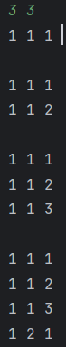

# 1차 풀이

```agsl
package algoHRiver.Baekjoon.BruteForce.NM15651;

import java.util.Scanner;

public class P15651 {

    static StringBuilder tmpArray = new StringBuilder();

    public static void recur(int index, int m, int n) {
        if (index == n) {
                System.out.println(tmpArray);
        } else {
            for (int i = 1; i <= m; i++) {
                StringBuilder tmp =tmpArray;
                tmpArray.append(i).append(" ");
                index++;
                recur(index, m, n);
                index--;
                tmpArray.delete(index,index+2);
            }
        }
    }


    public static void main(String[] args) {
        Scanner in = new Scanner(System.in);
        int m = in.nextInt();
        int n = in.nextInt();
        int index = 0;
        recur(index, m, n);


    }
}

```

- 처음에는 int출력을 했더니 시간초과, String을 활용하니 또 시간초과, 결국에 StringBuilder를 이용하니 답이 안나온다. 큰 수정이 필요하다.

# 2차 풀이
```agsl
package algoHRiver.Baekjoon.BruteForce.NM15651;

import java.util.Arrays;
import java.util.Scanner;

public class P15651 {

    static StringBuilder tmpArray = new StringBuilder();
    static int[] tmpArrayInt = new int[11];

    public static void recur(int index, int m, int n) {
        if (index == n) {

            for (int i = 0; i < n; i++) {
                tmpArray.append(tmpArrayInt[i]).append(" ");
            }
            tmpArray.append("\n");

        } else {
            for (int i = 1; i <= m; i++) {

                tmpArrayInt[index]=i;
                index++;
                recur(index, m, n);
                index--;

            }
        }
    }


    public static void main(String[] args) {
        Scanner in = new Scanner(System.in);
        int m = in.nextInt();
        int n = in.nextInt();
        int index = 0;
        recur(index, m, n);
        System.out.println(tmpArray);

    }
}

```

- 출력은 같으나 위와 아래 코드 출력속도는 매우 차이가 난다.

```agsl
package algoHRiver.Baekjoon.BruteForce.NM15651;

import java.util.Arrays;
import java.util.Scanner;

public class P15651 {

    static StringBuilder tmpArray;
    static int[] tmpArrayInt = new int[11];

    public static void recur(int index, int m, int n) {
        if (index == n) {
            tmpArray = new StringBuilder();
            for (int i = 0; i < n; i++) {
                tmpArray.append(tmpArrayInt[i]).append(" ");
            }
            System.out.println(tmpArray);
        } else {
            for (int i = 1; i <= m; i++) {

                tmpArrayInt[index]=i;
                index++;
                recur(index, m, n);
                index--;

            }
        }
    }


    public static void main(String[] args) {
        Scanner in = new Scanner(System.in);
        int m = in.nextInt();
        int n = in.nextInt();
        int index = 0;
        recur(index, m, n);


    }
}

```

- println은 내부적으로 동기화가 적용 - 오버헤드가 발생하여 시간이 매우 증가
- Stringbuilder는 마지막에 `\n` 이 없으면 println을 해도 개행문자가 적용이 안된다
- String은 불변 객체,값을 추가할때마다 새로운 문자열을 생성 하는 것이다.
<br>
<br>
- 근데 왜 함수 내부에서 StringBuilder 값을 출력하는거랑 밖에서 하는거랑 시간차이가 발생하는건가
  - 계속 StringBuilder를 초기화 해서 차이 발생
- 이제는 새로 생성 안하니까 값이 초기화 되지 않느 문제 발견 ,, 왜 내부에서 출력하면 발생하는건가?



  - 새로 생성하지 않고 1 1 1 \n 1 1 2 \n 1 1 3 이렇게 Stringbuilder 하나에 다 넣고 한 번에 출력하기 때문에 빠른 것이었다.
  - 계속 원래 String 이나 int를 for문을 통해 출력하던 기억때문에 Stringbuilder도 계속 초기화 되고 있다는 착각을 했다.
  - 실제로 위에 코드를 보면 계속 초기화해서 시간이 오래 걸리는것도 발견했었다.


